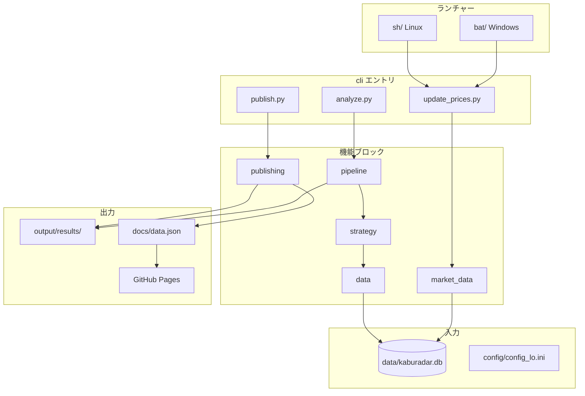

# アーキテクチャ

## 処理フロー（概要）



## パッケージ構成（機能ブロック）

```
src/kaburadar/
├── settings/              # パス定数・INI 読み込み・SCREENING キー
│   ├── paths.py
│   ├── loader.py
│   └── screening.py
├── domain/                # ドメイン定数（売買モード等）
│   └── constants.py
├── data/                  # SQLite リポジトリ
│   └── repository.py
├── strategy/              # RSI 戦略・バックテストエンジン
│   ├── rsi.py
│   ├── models.py
│   └── engine.py
├── pipeline/              # 解析オーケストレーション・集計
│   ├── analyze.py
│   └── aggregate.py
├── market_data/           # 株価取得・DB 更新
│   └── prices.py
├── publishing/            # GitHub Pages JSON
│   └── github_pages.py
├── scheduling/            # 時間帯バッチ起動
│   └── launcher.py
├── notifications/         # LINE（解析後サマリー optional）
│   ├── line.py
│   └── summary.py
├── cli/                   # 薄い CLI エントリ
│   ├── analyze.py
│   ├── update_prices.py
│   └── publish.py
├── config.py              # 後方互換（settings へ委譲）
└── analysis/              # 後方互換 import のみ
```

## 戦略

- **短期 RSI のみ**（`SCR_JDG_RSI4 = 1`）
- 旧来の MACD / ボリンジャー / 移動平均などのモジュールは削除済み

## データベース

- SQLite: 銘柄マスタ、銘柄別価格テーブル、`tbl_code_set`
- 集計時に `TradeHist` テーブルを再作成（破壊的更新）— 本番 DB を指さないよう注意

## GitHub Pages

- `master` の `docs/data.json` を push
- Actions が `docs/` 全体を `gh-pages` ブランチへデプロイ
- `docs/guide/` の Markdown はサイトには表示されない（リポジトリ上で閲覧）

## 互換レイヤ

| 旧 | 新 |
|----|-----|
| `tasks/analyze_all.py` | `cli/analyze.py` / `pipeline/analyze.py` |
| `scripts/publish_results.py` | `cli/publish.py` / `publishing/github_pages.py` |
| `kaburadar.analysis.*` | 各機能ブロック（`analysis/` は re-export のみ） |
| `kaburadar.config` | `kaburadar.settings`（`config.py` は維持） |
| `scheduler/launcher.py` | `scheduling/launcher.py` |
| `notify/line_notify.py` | `notifications/line.py` |
| `output/honban/` | `output/results/` |
| `DB/KabuRadar.db` | `data/kaburadar.db` |
